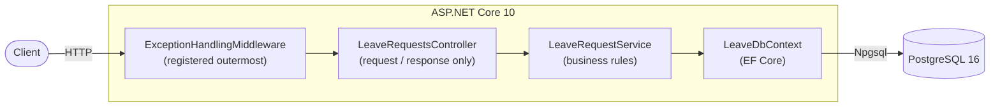

# LeaveApi


A minimal leave-management REST API built with ASP.NET Core 10, demonstrating layered architecture, a state-machine workflow, containerization and CI.

An employee submits a leave request; a reviewer approves it. Only a `Pending` request can be approved — approving it twice is a conflict, not a bad request.

---

## API

Base URL: `http://localhost:5000` (Docker) — interactive docs at `/swagger`.

| Method | Route | Description | Success | Errors |
|--------|-------|-------------|---------|--------|
| `POST` | `/api/LeaveRequests` | Create a leave request | `201` + `Location` + DTO | `400` end date before start date · `404` unknown employee · `409` overlapping request |
| `GET` | `/api/LeaveRequests/{id}` | Get one request | `200` + DTO | `404` |
| `GET` | `/api/LeaveRequests` | List with filters and paging | `200` + `PagedResult` | — |
| `PATCH` | `/api/LeaveRequests/{id}/approve` | Approve a request | `200` + DTO | `404` · `409` not pending |

**List query parameters** — `employeeId` and `status` are optional filters; `page` defaults to `1`; `pageSize` defaults to `20` and is capped at `100`.

```
GET /api/LeaveRequests?employeeId=1&status=Pending&page=1&pageSize=20
```

```json
{ "items": [ ... ], "page": 1, "pageSize": 20, "totalCount": 42 }
```

**Errors** use RFC 9457 `application/problem+json` — the same shape the framework already emits for model-validation failures, so the whole API speaks one error format:

```json
{
  "type": "https://tools.ietf.org/html/rfc9110#section-15.5.10",
  "title": "Conflict",
  "status": 409,
  "detail": "假單狀態不是待審核，無法核准。",
  "instance": "/api/LeaveRequests/1/approve",
  "traceId": "00-5e01aaaec199c82752b712b0cb85f48a-d1bb8dd2e88138e4-00"
}
```

Enums are sent and received as strings — `"Annual"`, `"Pending"` — not integers.

---

## Architecture



The controller only translates between HTTP and the service; it never touches `LeaveDbContext`. All business rules live in the service. The exception middleware is registered immediately after `builder.Build()` so it wraps everything downstream.

```
Controllers/    LeaveRequestsController
Services/       ILeaveRequestService, LeaveRequestService
Models/         Entities (Employee, LeaveRequest, enums) + Dtos
Data/           LeaveDbContext
Middleware/     ExceptionHandlingMiddleware, LeaveErrors
Migrations/     EF Core migration incl. seed data
tests/          xUnit, SQLite in-memory
```

---

## Design decisions

**No repository layer.** `DbContext` already implements the Unit of Work and Repository patterns; wrapping it again at this size is a duplicate abstraction. Tests run against a real relational engine instead, so nothing needs mocking.

**SQLite in-memory for tests, not the EF Core InMemory provider.** The InMemory provider is not a relational engine — it does not generate or execute SQL, does not enforce foreign keys and has no transaction semantics, and Microsoft's own guidance advises against using it as a test database. SQLite really produces and runs SQL. It is still not PostgreSQL, so dialect and type behaviour differ; the rigorous answer is Testcontainers with a real Postgres, which was judged not worth the CI time and dependency weight at this size.

**`409 Conflict`, not `400 Bad Request`, for re-approval.** `400` means the request is malformed. Approving an already-approved request is a perfectly well-formed request that conflicts with the current state of the resource — that is exactly what `409` is for.

**Enums are stored as `varchar(20)`, not `int`.** The database is directly readable and inserting a new status later cannot silently renumber existing rows. The cost is a larger column and slower comparison. *Known limitation:* only the application enforces the allowed values — a direct `INSERT` can still write arbitrary text. A `CHECK` constraint or a native PostgreSQL enum type would close that.

**Requests bind to a DTO, never to the entity.** Binding straight to `LeaveRequest` would let a client post `{"status":"Approved"}` and create a pre-approved request, bypassing the state machine entirely. `CreateLeaveRequestDto` exposes five fields and `Status` is not one of them. Responses use DTOs too, which also avoids the `Employee` ↔ `LeaveRequest` serialization cycle.

**One error format, and unexpected failures stay opaque.** `[ApiController]` already returns problem details for model-validation failures, so the exception middleware emits the same shape rather than inventing a second one. The format is RFC 9457, which obsoleted RFC 7807 in 2023 — the document structure is unchanged, so much of the .NET ecosystem still cites the older number. Known business failures put their message in `detail`; anything unexpected returns a generic title with no `detail` and is logged in full server-side, so an internal message never reaches the caller. Every response carries a `traceId` to tie a report back to a log entry.

**Migrations are applied on startup.** Convenient for a single-instance demo. In production this would move to a separate migration step so that multiple instances cannot race each other.

**No secrets in the repository.** The connection string comes from user secrets locally and from an environment variable in the container. User secrets are stored in plain text outside the repo — they solve version control, not secure storage; production would use a managed secret store.

**Dates are normalised to UTC.** The timestamp columns are `timestamptz`, and Npgsql only accepts `DateTimeKind.Utc`. Incoming values are converted according to their `Kind` rather than merely relabelled, so an offset-bearing input is not silently shifted.

### Known limitations

- The overlap check and the approval transition both read then write, so two concurrent requests can race. Closing this properly needs a database-level exclusion constraint and an optimistic-concurrency token respectively.
- No authentication or authorisation — any caller can approve any request.
- Rejection, leave balances and multi-step approval are out of scope.

---

## Quick start

### With Docker (recommended)

```bash
docker compose up --build
```

Then open **http://localhost:5000/swagger**.

The API waits for the PostgreSQL health check, applies migrations on startup and seeds two employees (`1` Anna, `2` Bill), so you can create a leave request immediately.

> If PostgreSQL rejects the password on an existing volume, that volume was initialised with different credentials — `POSTGRES_PASSWORD` only takes effect when the data directory is first created. Run `docker compose down -v` to recreate it.

### Running locally

Start the database only, then supply the connection string through user secrets:

```bash
docker compose up -d postgres
```

```bash
dotnet user-secrets set "ConnectionStrings:DefaultConnection" "Host=localhost;Port=15432;Database=mydb;Username=admin;Password=changeme;"
```

```bash
dotnet run
```

The app fails fast with an explanatory message if the connection string is missing. `LeaveApi.http` contains ready-made requests for every endpoint.

---

## Tests

```bash
dotnet test
```

19 tests. Nothing external is required — the service tests run against an embedded SQLite in-memory database, and the middleware tests drive the pipeline directly without a web host.

**Service tests** cover creation, date validation, unknown employees, and every branch of the overlap rule — including the cases that must *not* conflict (adjacent ranges, a previously rejected request, a different employee). Each test that expects a rejection also asserts that no row was written, since the exception type alone does not prove the check ran before the insert.

**Middleware tests** pin the exception-to-status-code mapping and the response payload shape. Without them, changing `ConflictException => 409` to `400` would keep every service test green while breaking the API contract.

---

## Stack

ASP.NET Core 10 · EF Core 10 · PostgreSQL 16 · Docker (multi-stage) · GitHub Actions · xUnit

CI runs `restore`, `build` and `test` in Release on every push to `main`.
